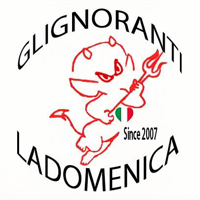

# 🏍️ Giro Gnorante 2025  
**Glignoranti Ladomenica**  
📅 *27 Giugno – 4 Luglio*  
🇮🇹🇭🇷🇧🇦  

> *Dal 2007 sulla strada, tra curve, chilometri e risate.  
> Non è una vacanza, è una missione… a due ruote.*  

---

## Giorno 1 – Torino → Portogruaro  
🛣️ **460 km (autostrada)**  
📍 [Mappa del percorso](https://www.google.com/maps/dir/Torino/Portogruaro)  

Partenza presto, casco in testa e motori caldi.  
Tappa di trasferimento per lasciare alle spalle la città e puntare verso l’Adriatico.  
Un pieno di chilometri, qualche sosta per sgranchirsi, e poi dritti a Portogruaro per la prima birra del tour. 🍺

---

## Giorno 2 – Portogruaro → Prizna  
🛣️ **274 km**  
📍 [Mappa del percorso](https://www.google.com/maps/dir/Portogruaro/Prizna,+Croazia)  

Il gruppo lascia l’Italia e varca il confine croato.  
Paesaggi verdi, tratti costieri e il profumo di mare nell’aria.  
Una tappa da godersi curva dopo curva, tra borghi e panorami che cominciano a cambiare faccia.  
Serata tranquilla a Prizna, dove l’avventura inizia davvero. 🌅

---

## Giorno 3 – Prizna → Marulovo  
🛣️ **233 km**  
📍 [Mappa del percorso](https://www.google.com/maps/dir/Prizna,+Croazia/Marulovo,+Croazia)  

Strade interne, silenziose e piene di carattere.  
Tra salite, montagne e rettilinei che invitano a dare gas, il viaggio entra nel suo ritmo.  
Qui non conta dove arrivi, ma come ci arrivi: con la moto che canta e il sorriso sotto il casco. 😎

---

## Giorno 4 – Marulovo → Mostar  
🛣️ **200 km**  
📍 [Mappa del percorso](https://www.google.com/maps/dir/Marulovo,+Croazia/Mostar,+Bosnia+and+Herzegovina)  

Si entra in Bosnia-Erzegovina, terra di storia e contrasti.  
**Mostar** accoglie con il suo famoso *Ponte Stari Most*, simbolo di rinascita dopo anni difficili.  
La città è viva, colorata, un mix di culture e profumi che restano addosso.  
Qui ogni biker capisce che viaggiare è anche attraversare storie. 🌉

---

## Giorno 5 – Mostar → Dubrovnik  
🛣️ **200 km**  
📍 [Mappa del percorso](https://www.google.com/maps/dir/Mostar,+Bosnia+and+Herzegovina/Dubrovnik,+Croatia)  

Si torna verso il mare.  
**Dubrovnik**, la Perla dell’Adriatico, si mostra con tutta la sua eleganza e le mura che guardano il mare.  
Tra vicoli antichi e birre ghiacciate, il gruppo si gode la tappa più scenografica del tour.  
Ogni foto qui diventa un poster. 📸

---

## Giorno 6 – Dubrovnik → Spalato  
🛣️ **220 km**  
📍 [Mappa del percorso](https://www.google.com/maps/dir/Dubrovnik,+Croatia/Split,+Croatia)  

La costa dalmata regala una delle strade più belle d’Europa: curve, mare e sole a picco.  
**Spalato** chiude la parte croata del viaggio, con il *Palazzo di Diocleziano* a fare da cornice.  
Un tuffo nel mare, una cena vista porto, e poi pronti al rientro. 🌊

---

## Giorno 7 – Spalato → Ancona (Traghetto)  
⛴️ **Traversata di circa 11 ore**  
📍 [Info Porto di Spalato](https://www.port-authority-split.hr/)  

Il traghetto notturno è il momento per rilassarsi.  
Le moto parcheggiate nella stiva, il gruppo sul ponte a guardare il mare nero e le stelle.  
Si brinda, si ride, si parla già del prossimo viaggio.  
L’odore di salsedine e benzina si mescola all’aria di libertà. 🌌

---

## Giorno 8 – Ancona → Torino  
🛣️ **600 km**  
📍 [Mappa del percorso](https://www.google.com/maps/dir/Ancona/Torino)  

Ultima tirata verso casa.  
Il corpo è stanco, ma la testa è piena di paesaggi, strade e risate.  
Ogni chilometro è un pezzo di storia condivisa con gli amici di sempre.  
E quando si spegne il motore… resta solo il silenzio di chi sa di aver vissuto qualcosa di vero. 🏁

---

## 🧾 Riepilogo Finale  

| Voce | Dettaglio |
|------|------------|
| **Durata** | 27 Giugno – 4 Luglio |
| **Km totali** | Circa 2.000 |
| **Nazioni attraversate** | Italia 🇮🇹, Croazia 🇭🇷, Bosnia-Erzegovina 🇧🇦 |
| **Luoghi simbolici** | Mostar (Ponte Stari Most), Dubrovnik (la Perla dell’Adriatico), Spalato (Palazzo di Diocleziano) |

---

💬 *Commenti finali:*  
Strade, amici e motori: la ricetta perfetta per sentirsi vivi.  
Ogni viaggio lascia un segno, ma quelli fatti insieme diventano leggenda.  

**Glignoranti Ladomenica – Since 2007**  
*Ride hard. Laugh louder. Live free.* 🤘  

